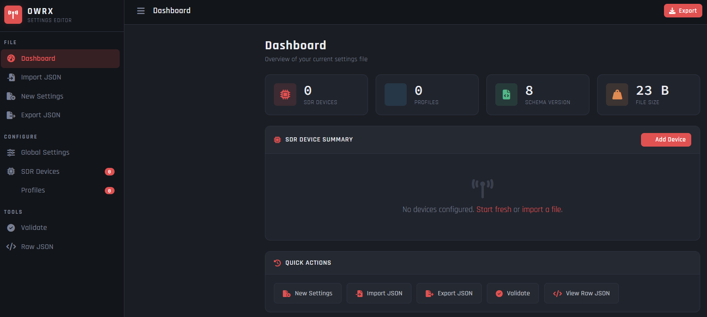

# OpenWebRX Settings Editor

<div align="center">

<!-- Replace the line below with your dashboard screenshot once captured -->
<!--  -->

[](LICENSE)
[](https://www.python.org/)
[](https://flask.palletsprojects.com/)
[](https://www.raspberrypi.com/)
[](https://www.openwebrx.de/)

**A web-based GUI for creating, importing, editing, and exporting OpenWebRX `settings.json` files.**  
Styled after the Pi-hole admin dashboard. Runs as a local Flask web server on Linux or Raspberry Pi.

[Installation](#installation) · [Features](#features) · [Screenshots](#screenshots) · [Configuration](#configuration) · [Usage](#usage) · [Contributing](#contributing)

</div>

---

## Overview

OpenWebRX stores all SDR hardware and band profile configuration in a single `settings.json` file.
Editing it by hand — especially when managing dozens of profiles across multiple devices — is tedious
and error-prone.

**OpenWebRX Settings Editor** gives you a clean web interface to manage that file without touching
JSON directly:

- Add and configure SDR devices (RTL-SDR, HackRF, AirSpy, SDRplay, PlutoSDR, and more)
- Build band profiles with all supported fields (frequency, sample rate, modulation, gain, squelch,
  tuning step, direct sampling, and more)
- Set global receiver properties (name, GPS location, waterfall levels, FFT size)
- Validate your settings before deploying
- Export a ready-to-use `settings.json` with one click

---

## Features

| Feature | Details |
|---|---|
| **Dashboard** | Live stat cards — device count, profile count, file size, schema version |
| **SDR Device Manager** | Add / edit / delete devices with all device-level fields |
| **Profile Manager** | Full profile editor with search and per-device filter |
| **Global Settings** | Receiver name, GPS, waterfall range, FFT size, max clients, audio compression |
| **Validation** | Server-side check with error and warning breakdown before export |
| **Raw JSON Editor** | View, edit, and apply raw JSON directly with copy-to-clipboard |
| **Import** | Upload any existing `settings.json` to continue editing |
| **Export** | Download a valid `settings.json` ready to drop into OpenWebRX |
| **Keyboard Shortcuts** | `Ctrl+S` export · `Ctrl+O` import · `Esc` close modal |
| **Dark Theme** | Pi-hole AdminLTE-inspired dark UI — easy on the eyes at 2 AM |

---

## Screenshots

> **To maintainer:** Add screenshots to `docs/screenshots/` and uncomment the image lines below.

### Dashboard
[Dashboard](docs/screenshots/dashboard.png)
*Dashboard — stat cards, SDR summary, quick actions*

### SDR Devices
[SDR Devices](docs/screenshots/devices.png)
*SDR Devices — add, edit, delete hardware entries*

### Profile Editor
[Profile Editor](docs/screenshots/profile-editor.png)
*Profile Editor — full field set including modulation, gain, squelch, direct sampling*

### Global Settings
[Global Settings](docs/screenshots/global-settings.png)
*Global Settings — receiver name, GPS coordinates, waterfall levels, FFT size*

### Validation
[Validation](docs/screenshots/validate.png)
*Validation — errors and warnings before export*

### Raw JSON Editor
[Raw JSON](docs/screenshots/raw-json.png)
*Raw JSON — view, edit, and apply settings.json directly*

---

## Requirements

| Requirement | Version |
|---|---|
| Python | 3.8 or newer |
| pip | any recent version |
| OS | Debian · Ubuntu · Raspberry Pi OS · Fedora · RHEL / CentOS |
| Browser | Any modern browser (Chrome, Firefox, Safari, Edge) |

> The installer handles all Python dependencies automatically.  
> No Node.js, no npm, no external services required.

---

## Installation

### One-line install (recommended)

Clone the repository and run the installer as root. The script will:

1. Install Python 3, pip, and venv via your system package manager
2. Copy the app to `/opt/owrx-editor/`
3. Create a Python virtual environment and install Flask
4. Generate a random `SECRET_KEY` and write `/opt/owrx-editor/.env`
5. Create and enable a **systemd service** (`owrx-editor`) that starts automatically on boot
6. Open port `5000` in UFW or firewalld if either is active

```bash
git clone https://github.com/jermsmit/OpenWebRX_Settings_Editor.git
cd OpenWebRX_Settings_Editor
sudo bash install.sh
```

Once complete, open your browser to:

```
http://<your-device-ip>:5000
```

> **Raspberry Pi tip:** find your IP with `hostname -I`

---

### Manual install (development / advanced)

```bash
git clone https://github.com/jermsmit/OpenWebRX_Settings_Editor.git
cd OpenWebRX_Settings_Editor

python3 -m venv venv
source venv/bin/activate          # Windows: venv\Scripts\activate

pip install -r requirements.txt
python app.py
```

Then open `http://localhost:5000`.

---

### Updating an existing install

```bash
cd OpenWebRX_Settings_Editor
git pull
sudo bash install.sh
sudo systemctl restart owrx-editor
```

---

## Configuration

The installer creates `/opt/owrx-editor/.env`. Edit it to change any defaults:

```env
OWRX_HOST=0.0.0.0       # bind address (0.0.0.0 = all interfaces)
OWRX_PORT=5000           # port the web UI listens on — change if 5000 conflicts
OWRX_DEBUG=false         # set true only during development
SECRET_KEY=<generated>   # auto-generated at install — do not share or commit
```

After editing, restart the service:

```bash
sudo systemctl restart owrx-editor
```

> ⚠️ **Security notice:** This app has **no built-in authentication**. It is designed for local / LAN
> use only. Do **not** expose port 5000 to the public internet. If remote access is needed, place a
> reverse proxy with authentication in front of it (e.g. nginx + HTTP basic auth, or Authelia).

---

## Service Management

The installer registers a systemd service. Use standard `systemctl` commands:

```bash
# Check status
sudo systemctl status owrx-editor

# Start / stop / restart
sudo systemctl start owrx-editor
sudo systemctl stop owrx-editor
sudo systemctl restart owrx-editor

# Enable / disable auto-start on boot
sudo systemctl enable owrx-editor
sudo systemctl disable owrx-editor

# View live logs
sudo journalctl -u owrx-editor -f
```

---

## Usage

### Creating a new settings file

1. Click **New Settings** in the sidebar (or from Dashboard quick actions)
2. Open **Global Settings** to set your receiver name, location, and top-level options
3. Open **SDR Devices** → **Add Device** and fill in your hardware details
4. Open **Profiles** → **Add Profile**, select your device, and configure the band
5. Repeat step 4 for each frequency band or profile you need
6. Click **Validate** to check for errors or warnings
7. Click **Export JSON** (or press `Ctrl+S`) to download your `settings.json`

### Importing and editing an existing file

1. Click **Import JSON** in the sidebar (or press `Ctrl+O`)
2. Select your existing `settings.json`
3. All devices and profiles load into the editor
4. Make your changes, validate, and export

### Deploying to OpenWebRX

Copy the exported `settings.json` to your OpenWebRX installation:

```bash
# Adjust path to match your OpenWebRX setup
sudo cp settings.json /etc/openwebrx/settings.json
sudo systemctl restart openwebrx
```

---

## Supported OpenWebRX Fields

### Device-level fields

| Field | Type | Notes |
|---|---|---|
| `name` | string | Display name shown in OpenWebRX |
| `type` | string | `rtl_sdr`, `hackrf`, `airspy`, `sdrplay`, etc. |
| `device_index` | integer | 0-based index when using multiple devices |
| `rf_gain` | number \| `"auto"` | dB gain value or `"auto"` |
| `ppm` | integer | Frequency correction in parts per million |
| `device` | string | Serial number or device string (optional) |
| `driver` | string | SoapySDR driver name (SoapySDR types only) |

### Profile-level fields

| Field | Type | Notes |
|---|---|---|
| `name` | string | Profile display name |
| `center_freq` | integer | Center frequency in Hz |
| `start_freq` | integer | Initial tuned frequency in Hz |
| `samp_rate` | integer | Sample rate in Hz (max stable: 2,400,000) |
| `start_mod` | string | Initial demodulation mode |
| `rf_gain` | number \| `"auto"` | Per-profile gain override (inherits from device if blank) |
| `tuning_step` | integer | Frequency step size in Hz |
| `initial_squelch_level` | integer | Squelch threshold in dB |
| `direct_sampling` | integer | `0` off · `1` I-branch · `2` Q-branch |
| `offset_tuning` | boolean | Enable offset tuning |

> **RTL-SDR V4 note:** Do **not** set `direct_sampling` on the V4. The built-in upconverter handles
> all HF reception (500 kHz – 28.8 MHz) natively. Setting `direct_sampling` on a V4 bypasses the
> upconverter and degrades HF performance.
>
> **RTL-SDR V3 and older:** Use `direct_sampling: 2` (Q-branch) for all profiles below 28.8 MHz.

### Supported modulation modes

`nfm` · `wfm` · `am` · `lsb` · `usb` · `cw` · `dmr` · `dstar` · `ysf` · `nxdn` · `m17` ·
`wspr` · `js8` · `packet` · `adsb` · `ism` · `page` · `pocsag` · `drm`

---

## Project Structure

```
OpenWebRX_Settings_Editor/
├── app.py                   ← Flask application and API routes
├── requirements.txt         ← Python dependencies (flask, werkzeug)
├── install.sh               ← Bash installer for Linux / Raspberry Pi
├── LICENSE                  ← MIT License
├── CHANGELOG.md             ← Version history
├── CONTRIBUTING.md          ← Contribution guidelines
├── .gitignore               ← Excludes venv/, .env, __pycache__, etc.
├── templates/
│   └── index.html           ← Single-page web UI (Jinja2 template)
├── static/
│   ├── css/
│   │   └── style.css        ← Pi-hole dark theme stylesheet
│   └── js/
│       └── app.js           ← Frontend application logic (vanilla JS)
└── docs/
    └── screenshots/         ← UI screenshots for this README
```

---

## API Endpoints

The Flask backend exposes a small REST API consumed by the frontend:

| Method | Endpoint | Description |
|---|---|---|
| `GET` | `/api/default` | Returns a blank default settings structure |
| `POST` | `/api/import` | Accepts a `settings.json` upload, returns parsed JSON |
| `POST` | `/api/validate` | Validates a settings object, returns errors and warnings |
| `POST` | `/api/export` | Returns a formatted `settings.json` as a file download |
| `GET` | `/api/modulations` | Returns the list of supported modulation modes |
| `GET` | `/api/sdr_types` | Returns the list of supported SDR device types |

---

## Related Projects

- [OpenWebRX](https://www.openwebrx.de/) — the SDR web receiver this tool configures
- [RTL-SDR Blog](https://www.rtl-sdr.com/) — hardware guides and software for RTL-SDR
- [openWebRX_Settings](https://github.com/jermsmit/openWebRX_Settings) — example `settings.json` files by the same author

---

## Contributing

Contributions are welcome! See [CONTRIBUTING.md](CONTRIBUTING.md) for full guidelines.

- 🐛 [Report a bug](https://github.com/jermsmit/OpenWebRX_Settings_Editor/issues/new)
- 💡 [Request a feature](https://github.com/jermsmit/OpenWebRX_Settings_Editor/issues/new)
- 🔀 [Submit a pull request](https://github.com/jermsmit/OpenWebRX_Settings_Editor/pulls)

---

## Changelog

See [CHANGELOG.md](CHANGELOG.md) for version history.

---

## License

[MIT License](LICENSE) — Copyright © 2025 [jermsmit](https://github.com/jermsmit)

---

<div align="center">
Made for the OpenWebRX and RTL-SDR community
</div>
